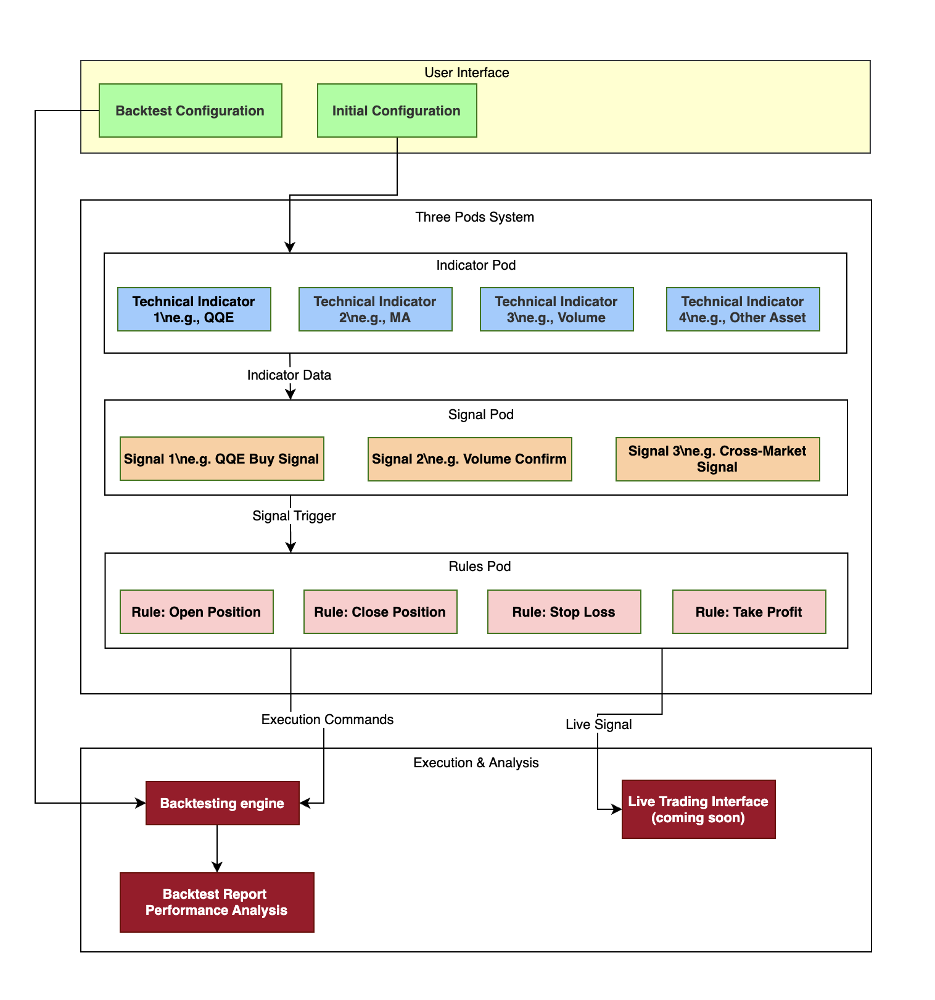

# PodTrader

## Contents

- [Introduction](#introduction)
- [How it works](#how-it-works)
- [Features](#features)
- [Setup](#setup)
- [Support](#support)

## Introduction
 
`PodTrader` is a platform designed for developing and executing quantitative trading strategies. It uses a three-tier architecture—Indicators, Signals, and Rules—so you can easily create, backtest, and manage sophisticated trading logic through a user-friendly graphical interface. By supporting multiple markets and asset classes, PodTrader allows you to seamlessly integrate cross-market relationships, custom indicators, capital allocation, and risk control strategies into an automated trading system.
 
The goal of this repo is to democratize access to advanced trading methodologies, allowing users of all skill levels to explore, create, and test their own trading strategies. By enabling individuals to customize indicators based on various advanced metrics, we strive to break down the barriers traditionally faced by novice traders.
 
If you like this project, please consider sharing it online. We welcome contributions from everyone! Feel free to give us feedback: report bugs, suggest features, or submit code improvements, your input is invaluable.

## How it works



## Features

- `Three-Tier Architecture`
- `Indicators`: Configure a variety of built-in or custom indicators.
- `Signals`: Build conditional expressions that trigger trading actions.
- `Rules`: Define how and when to open/close positions, as well as risk controls like stop-loss and take-profit.
- `Cross-Market Support`
- Trade across multiple asset classes (stocks, commodities, futures, etc.).
- Combine signals from different markets into a single, cohesive strategy.
- `One-Click Backtesting`
- Easily set up your backtest parameters, including time range, capital, commission, and slippage.
- Get immediate feedback on your strategy’s performance through detailed results.
- `Intuitive Interface`
- No complex scripting required—use the integrated GUI to assemble strategies with drag-and-drop or form-based editors.
- Quickly iterate and refine your strategy with minimal overhead.

## Setup

### Prerequisites

- Python 3.10+

### Installation

1. Clone the repository:

```bash
```

2. Install the required packages:

```bash
pip install -r requirements.txt
```

## Support

Have questions or suggestions? Feel free to reach out!* Email: julianwong925@gmail.com
