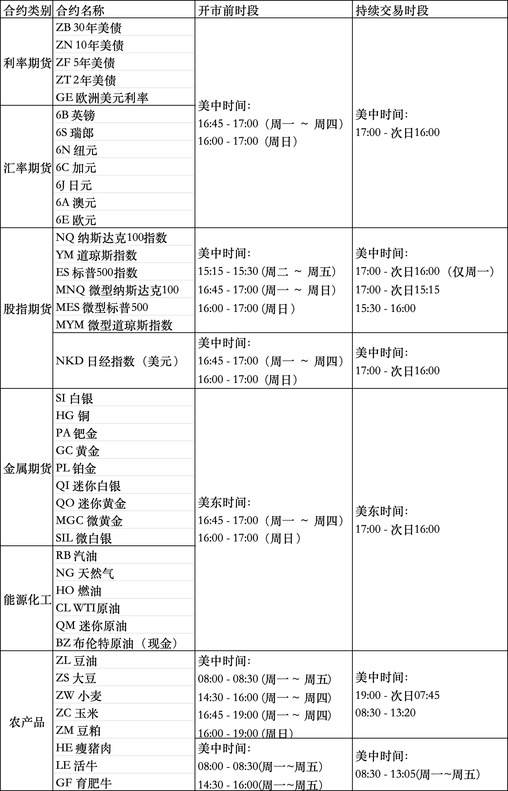

# K线图聚合算法

K线图聚合算法是指将原始数据聚合成更大周期的数据，例如将1分钟K线聚合成5分钟K线。聚合算法有多种实现方式，本文介绍了几种常见的聚合算法。

---

## 美股（美东时间UTC-4）

主要交易所：纽约证券交易所（NYSE）、纳斯达克证券交易所（NASDAQ）

**交易时段：**
- 常规交易时段（Regular Trading Hours，RTH）：9:30 - 16:00
- 盘前交易时段（Pre-Market）：4:00 - 9:30
- 盘后交易时段（After-Hours）：16:00 - 20:00

**聚合算法（不包含盘前、盘中数据）：**

| 频率   | 交易时间覆盖范围                                      |
| ------ | ----------------------------------------------------- |
| 1天    | 9:30 - 16:00                                          |
| 4小时  | 09:30 - 13:30, 13:30 - 16:00                          |
| 1小时  | 9:30, 10:30, 11:30, 12:30, 13:30, 14:30, 14:30, 15:30 |
| 1小时  | 9:00, 10:00, 11:00, 12:00, 13:00, 14:00, 15:00, 16:00 |
| 15分钟 | 9:30 - 16:00, 每15分钟一个周期                        |
| 5分钟  | 9:30 - 16:00, 每5分钟一个周期                         |
| 1分钟  | 9:30 - 16:00, 每1分钟一个周期                         |

---

## 美股期货期权（美东时间UTC-4）

主要交易所：芝加哥商品交易所（CME）、洛杉矶商品交易所（COMEX）、ICE期货交易所（ICE）、芝加哥期货交易所（CBOT）

**交易时段：**

---

## 港股（中国香港UTC+8）

主要交易所：香港交易所（HKEX）

**交易时段：**
- 早盘交易时段：9:30 - 12:00
- 午休时段：12:00 - 13:00
- 午盘交易时段：13:00 - 16:00

**聚合算法：**

| 频率   | 交易时间覆盖范围                                       |
| ------ |------------------------------------------------|
| 1天    | 9:30 - 16:00                                   |
| 4小时  | 09:30 - 12:00, 13:00 - 16:00                   |
| 1小时  | 9:30, 10:30, 11:30, 12:30, 13:30, 14:30, 15:30 |
| 15分钟 | 9:30 - 12:00, 13:00 - 16:00, 每15分钟一个周期         |
| 5分钟  | 9:30 - 12:00, 13:00 - 16:00, 每5分钟一个周期          |
| 1分钟  | 9:30 - 12:00, 13:00 - 16:00, 每1分钟一个周期          |

---

## A股（中国上海UTC+8）

主要交易所：上海证券交易所（SSE）、深圳证券交易所（SZSE）

**交易时段：**
- 早盘交易时段：9:30 - 11:30
- 午休时段：11:30 - 13:00
- 午盘交易时段：13:00 - 15:00

**聚合算法：**

| 频率   | 交易时间覆盖范围                                      |
| ------ | ----------------------------------------------------- |
| 1天    | 9:30 - 15:00                                          |
| 4小时  | 09:30 - 11:30, 13:00 - 15:00                          |
| 1小时  | 9:30, 10:30, 11:30, 13:00, 14:00                      |
| 15分钟 | 9:30 - 11:30, 13:00 - 15:00, 每15分钟一个周期         |
| 5分钟  | 9:30 - 11:30, 13:00 - 15:00, 每5分钟一个周期          |
| 1分钟  | 9:30 - 11:30, 13:00 - 15:00, 每1分钟一个周期          |
